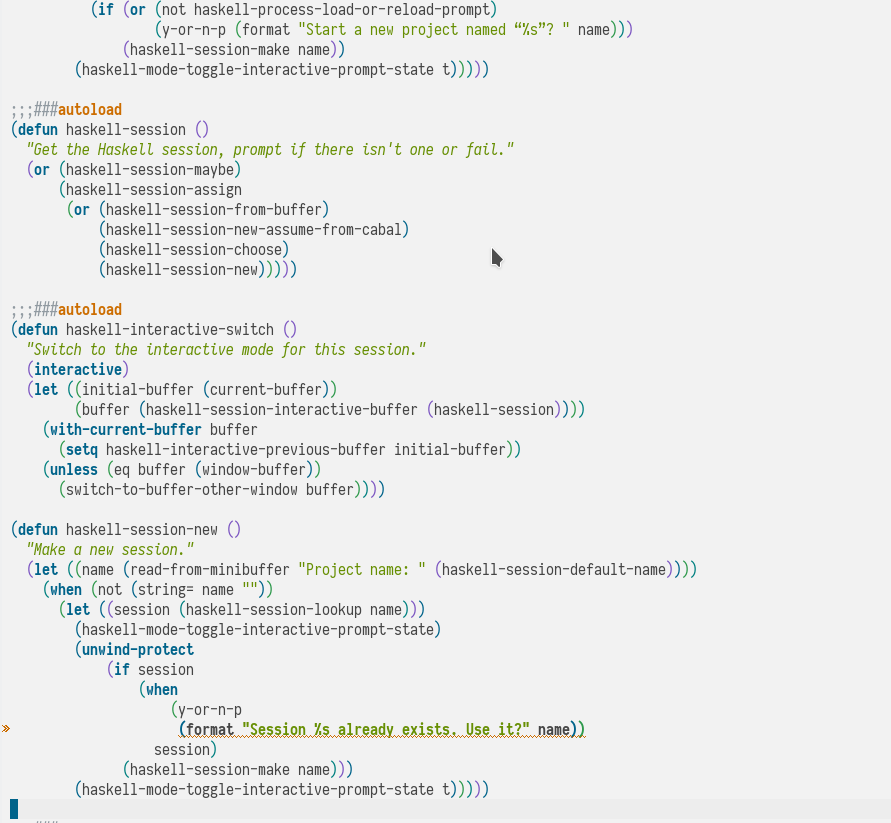
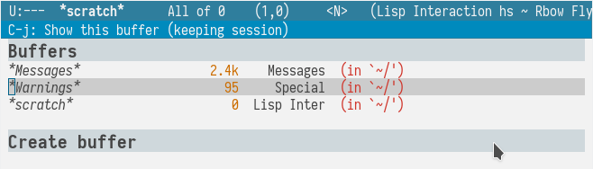
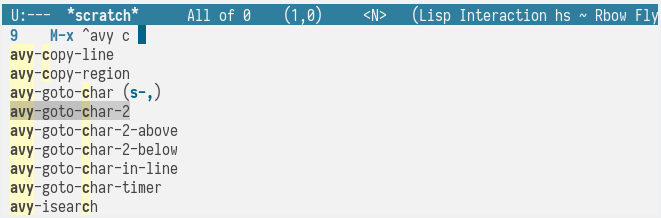
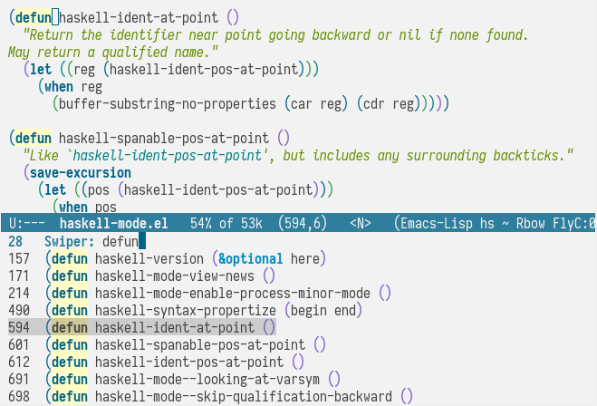
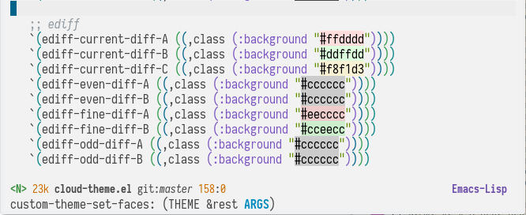
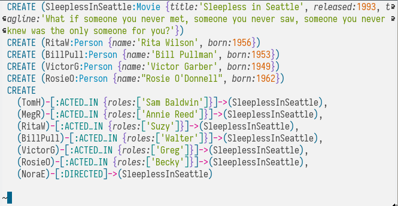

cloud-theme
===========

[![License GPL 3][badge-license]](https://github.com/vallyscode/cloud-theme/blob/master/LICENSE)

Light theme for emacs

## elisp

## helm

## ivy

## swiper

## modeline

## cypher-mode

## installation (MELPA)

    M-x package-install RET cloud-theme

## setup

    (load-theme 'cloud-theme t)

## installation (package-use)

    (use-package cloud-theme
        :ensure t
        :config
        (load-theme 'cloud t))

[badge-license]: https://img.shields.io/badge/license-GPL_3-green.svg
